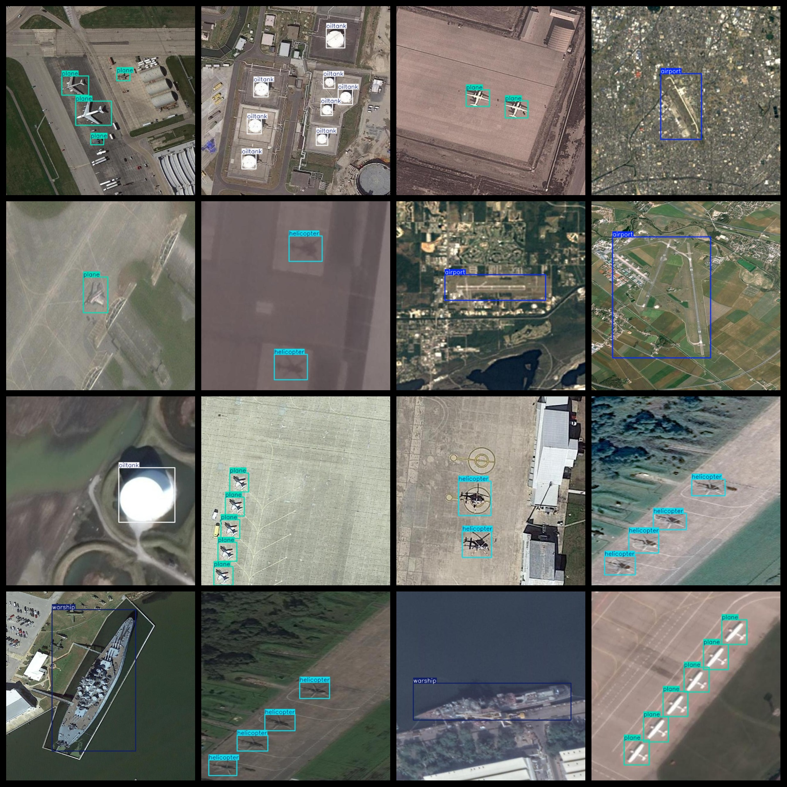
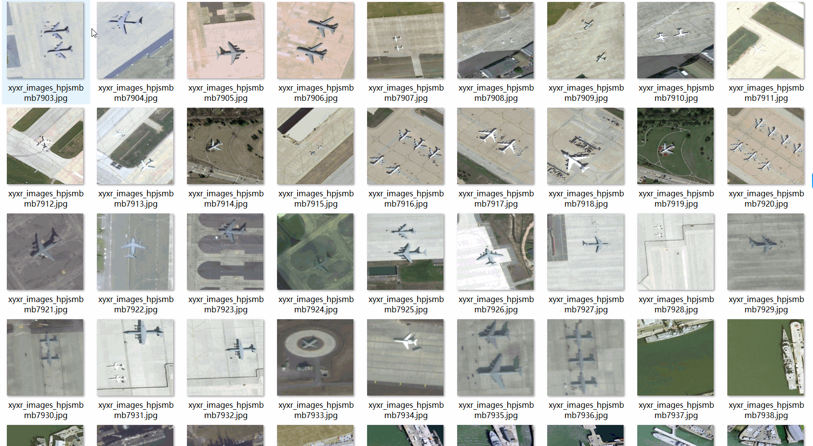

# UAV Aerial Military Target Detection Dataset - 9840 Images, VOC+YOLO Format

The UAV Aerial Military Target Detection Dataset consists of 9840 images in the VOC+YOLO format. The dataset is organized into three folders: JPEGImages, Annotations, and labels.

In the JPEGImages folder, there are a total of 9840 jpg images.

The Annotations folder contains a total of 9840 xml files.

Lastly, the labels folder contains a total of 9840 txt files.

There are a total of 5 label categories: "airport", "helicopter", "oiltank", "plane", and "warship".

Each label has a different number of boxes (the yolo format category order may vary from this, but it aligns with the classes.txt file in the labels folder).

- Airport boxes: 1829
- Helicopter boxes: 3507
- Oiltank boxes: 5490
- Plane boxes: 7577
- Warship boxes: 3683

Total box count: 22086

All images are of high resolution clarity.

Images have been enhanced.

Label shapes are square boxes used for object detection and recognition.

Important notes: No guarantees are made regarding the accuracy or reasonableness of the labeled models or weights. The dataset only provides accurate and reasonable annotations.

Annotation and image details are as follows:

## Images

---

Here is a pay link on Stripe (https://buy.stripe.com/3cs8yP7sY87d0vu9AB). Please contact me lonlonago@foxmail.com after funding $89, and I will send you a complete data files, thank you!

